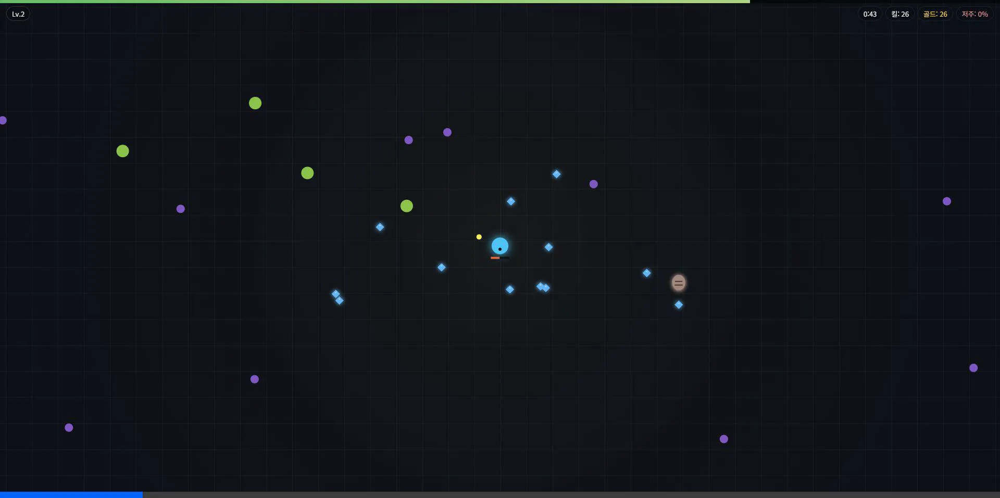

# Ashen Requiem (Vamplike)

> HTML / JavaScript 기반의 뱀서라이크(Vampire Survivors-like) 프로젝트입니다.
> MVP를 넘어 **Phase 2 확장 구조를 실제로 운용 중인** 브라우저 액션 게임 프로젝트입니다.

## Gameplay Demo


## 프로젝트 비전 및 목표

브라우저 환경에서 동작하는 성능 좋고 확장성 있는 뱀서라이크 게임을 만듭니다.
기본 전투 루프를 넘어서 **메타 진행, 세션 저장/복원, 보스/페이즈, 무기 진화, 도감, 설정/사운드, 성능 기준선 검증**까지 포함한 Phase 2 기반을 확장하고 있습니다.

---

## 엔진 아키텍처 개요

본 프로젝트는 무거운 범용 엔진 대신 아래와 같은 명확한 **책임 분리 원칙**을 기반으로 자체 구축되었습니다.

- **Scene**: 게임의 흐름 제어 (메인 화면 ↔ 플레이 ↔ 결과)
- **System**: 게임 규칙 로직 전담 (이동, 스폰, 충돌, 데미지 등)
- **Entity**: 얇은 데이터/상태 객체
- **Renderer / UI**: 규칙 개입 없이 화면 출력 및 입력 전달 전담

이 아키텍처를 바탕으로 데이터 베이스(`src/data/`) 확장만으로도 새로운 몬스터와 무기, 업그레이드를 손쉽게 추가할 수 있습니다.

> 🛠 **AI 에이전트 및 개발자 가이드**: 
> 규칙과 설계 원칙은 [AGENTS.md](./AGENTS.md)를, 현재 구현 사실과 파이프라인 스냅샷은 [docs/architecture-current.md](./docs/architecture-current.md)를 기준으로 확인합니다.
> 현재 구조 스냅샷을 다시 출력하려면 `npm run architecture:snapshot`를 사용합니다.
> baseline에 직접 묶이지 않은 maintenance script의 역할은 [docs/maintenance-scripts.md](./docs/maintenance-scripts.md)에 분리해 둡니다.

---

## 현재 구현 상태

### Core Loop
- [x] 플레이어 및 적 추적 이동
- [x] 자동 공격 로직 및 투사체 발사
- [x] 적 처치 및 경험치 획득 루프
- [x] 레벨업 시 3개 선택지 제공
- [x] 시간 경과에 따른 적 스폰량 증가 (웨이브 시스템)

### Implemented Expansion Surface
- [x] 메타 진행 상점 (`MetaShopScene`)
- [x] 세션 저장/로드와 마이그레이션 (`localStorage`)
- [x] 보스 페이즈, 보스 알림, 보스 데이터
- [x] 시너지 및 무기 진화 시스템
- [x] 도감/런 기록 조회 (`CodexScene`)
- [x] 설정 화면, 오디오 볼륨, 렌더 품질 프리셋
- [x] 세션 스냅샷 export/import/reset UX (`SettingsScene`)
- [x] 저장 슬롯 inspection / backup restore UX
- [x] 세션 import preview / diff 요약 UX
- [x] 접근성 옵션 (`reduced motion`, `HUD 가독성`, `큰 글씨`)
- [x] 입력 커스터마이징(키 리맵)
- [x] 데일리 챌린지 승리 보상과 Codex daily 통계
- [x] daily streak / milestone 보상과 결과·Codex 추천 조정
- [x] 추가 stage / 무기 / 장신구 데이터 확장
- [x] seamless procedural stage background pipeline
- [x] 파이프라인 성능 예산 검증 (`profile:check`)
- [x] deterministic browser smoke 시나리오

### Near-Term Focus
- [ ] 메타/도감/런타임 UI 폴리싱
- [ ] 적/무기/장신구 데이터 추가 확장
- [ ] 보스 패턴과 stage gimmick 추가 확장
- [ ] 저장 데이터와 해금 흐름 추가 고도화
- [ ] 입력 프리셋/중복 키 충돌 UX 고도화

---

## 씬 구성

- `TitleScene`: 시작 화면과 진입 허브
- `PlayScene`: 전투 런타임
- `MetaShopScene`: 영구 업그레이드 상점
- `CodexScene`: 적/무기/기록 도감
- `SettingsScene`: 옵션 설정

런 종료 결과는 별도 `ResultScene`이 아니라 `PlayScene`의 결과 오버레이와 `playResultApplicationService` 경로로 처리됩니다.
플레이 파이프라인, 이벤트 흐름, 세션 경계는 [docs/architecture-current.md](./docs/architecture-current.md)에 정리되어 있습니다.

---

## 폴더 구조

```text
src/         런타임 코드. scene / app / domain / system / ui / data 계층 포함
tests/       Node 기반 단위·소스 계약 테스트
scripts/     검증·프로파일·스모크·문서 snapshot 스크립트
docs/        아키텍처 현재 상태, wrapper inventory, 유지보수 문서
public/      Vite가 그대로 복사하는 정적 자산
output/      deterministic smoke / playwright 산출물 (git 추적 제외)
dist/        production build 산출물 (git 추적 제외)
```

---

## 개발 환경 및 실행 방법

### 로컬 서버 실행
프로젝트는 Vite를 번들러 및 개발 서버로 사용합니다.

```bash
npm install
npm run dev
```
(브라우저에서 `http://localhost:5173` 으로 접속)

### 테스트 및 검증
주요 시스템들의 무결성과 데이터 정합성을 검증하기 위한 자동화된 테스트가 준비되어 있습니다.

```bash
# 설치
npm install

# 데이터 무결성 검증 (순환 참조, 잘못된 ID 등)
npm run validate

# scoped checkJs 기반 타입 검증
npm run typecheck

# 아키텍처 lint baseline (import 경계 + 문서 drift)
npm run lint

# 문서 drift만 빠르게 검사
npm run check:architecture-docs

# wrapper inventory snapshot 재생성
npm run compatibility:wrappers

# 프로덕션 build
npm run build

# 전체 단위 테스트 실행 (Node.js Test Runner)
# pretest로 validate가 자동 실행된다.
npm test

# 빌드 후 실제 브라우저에서 core deterministic smoke 실행
npm run test:smoke

# 전체 deterministic smoke 실행
npm run test:smoke:full

# 이미 build된 dist를 재사용하는 smoke 실행
npm run smoke:core:prebuilt
npm run smoke:full:prebuilt

# 로컬 빠른 기준선: typecheck + profile budget + lint + unit test + build
npm run verify

# 로컬 브라우저 smoke 기준선: single build + core deterministic smoke
npm run verify:smoke

# CI 기준선: single build + core browser smoke
npm run verify:ci

# 파이프라인 성능 요약(JSON)
npm run profile:json

# 파이프라인 성능 예산 검사
npm run profile:check

# encounter/wave/stage authoring report 출력
npm run encounter:report
```

deterministic smoke 산출물은 `output/web-game/deterministic-smoke-core/`와 `output/web-game/deterministic-smoke-full/`로 분리된다.
CI/extended smoke는 prebuilt smoke 스크립트를 사용해 동일 `dist`를 재사용한다.

## 환경 변수 및 디버그 플래그

일상적인 실행에는 별도 `.env`가 필요하지 않습니다. 현재 문서화해야 할 런타임/검증용 입력은 아래와 같습니다.

| Name | Scope | Purpose |
|---|---|---|
| `TEST_DIR` | `scripts/runTests.js` | 기본 `tests/` 대신 다른 테스트 디렉터리를 실행 |
| `TEST_MATCH` | `scripts/runTests.js` | 파일명 일부 일치 기준으로 테스트 실행 범위를 좁힘 |
| `TEST_TIMEOUT_MS` | `scripts/runTests.js` | 테스트 파일별 timeout override |
| `TEST_JOBS` | `scripts/runTests.js` | 병렬 worker 수 override |
| `ASHEN_SMOKE_DEBUG=1` | browser smoke | smoke wrapper의 상세 debug log 활성화 |
| `?debugRuntime` | 브라우저 query flag | 안정된 `__ASHEN_DEBUG__` host를 노출해 deterministic smoke/debug helper 활성화 |
| `__ASHEN_PROFILE_PIPELINE__ = true` | browser global | `PlayScene` pipeline profiler를 opt-in으로 활성화 |

## 문서 유지 규칙

- 설계 규칙은 [AGENTS.md](./AGENTS.md)를 SSOT로 유지합니다.
- 현재 구현 사실은 [docs/architecture-current.md](./docs/architecture-current.md)에 맞춥니다.
- wrapper inventory는 [docs/compatibility-wrappers.md](./docs/compatibility-wrappers.md)와 `npm run compatibility:wrappers` 출력으로 맞춥니다.
- maintenance script 분류는 [docs/maintenance-scripts.md](./docs/maintenance-scripts.md)를 갱신합니다.
